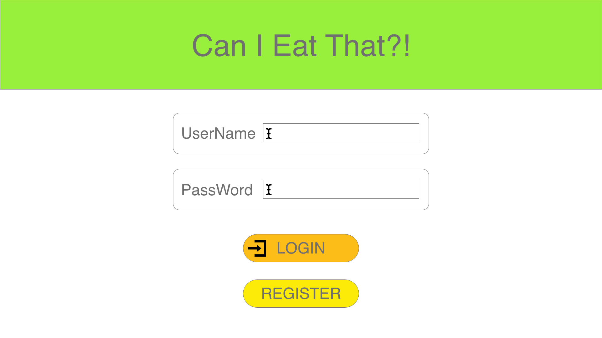
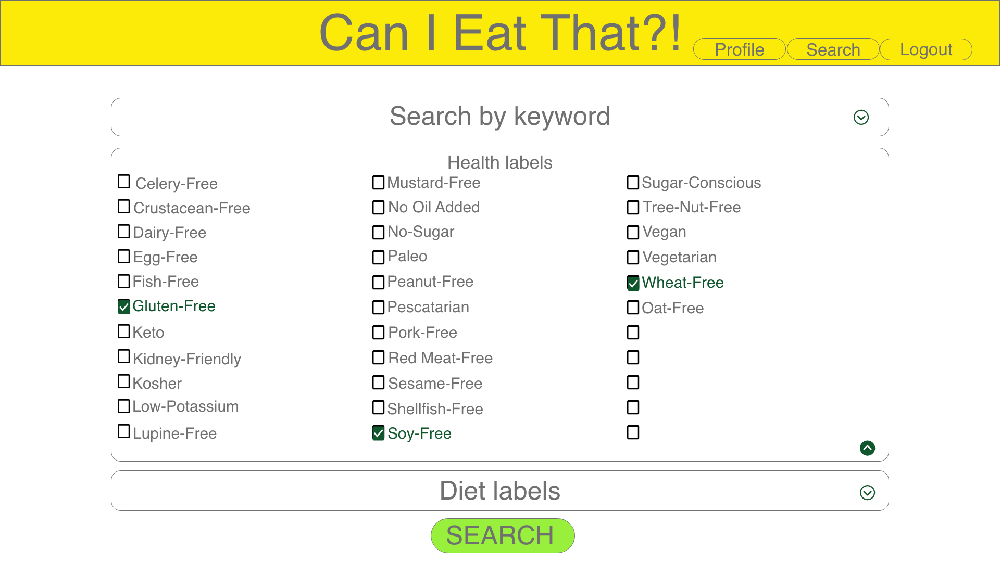
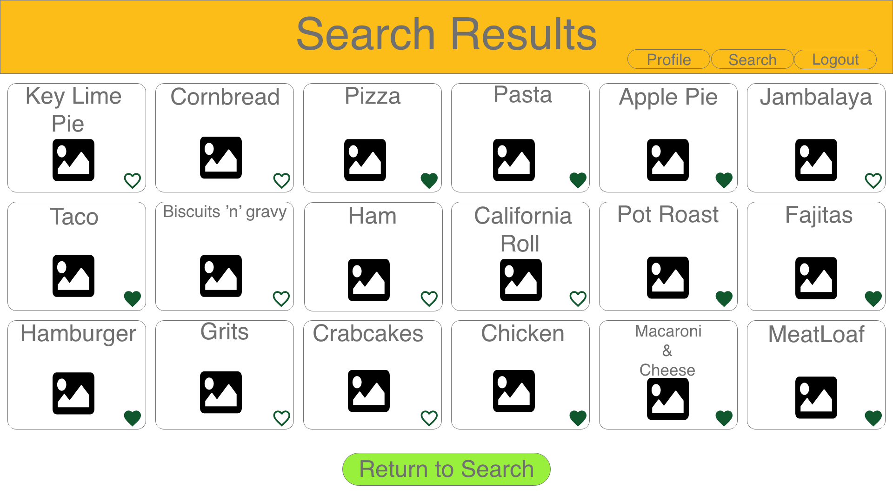

# Can I Eat That?

## Table of Contents

* [License](#license)
* [Links](#links)
* [User Story](#user-story)
* [Technology Used](#technology-used)
* [Mockups and Screenshots](#mockups-and-screenshots)
* [Questions](#questions)
* [Credits](#credits)

## Description
 
Can I Eat That? is an PWA designed for those who struggle to find recipes that they can make with food allergies. Can I Eat That? Is a
site where people with food allergies can go to help them search for recipes that they can make with a certain food allergy. You are
given options to select from that will help narrow down your searches. Can I Eat That? is also for user that are on diets and users that are trying to eat health. There are options for users to select that will help them find recipes to go with all types of diets and healthy eating.
  
## License
 
* 
  
## Links
 
* [Github Repository](https://github.com/Drowekorte/can-i-eat-that) 
* [Heroku App]()
 
## User Story

>GIVEN a PWA-style food search site   
WHEN I visit the site for the first time   
THEN I am presented with the homepage, which includes two talent ISO talent buttons and a “Sign-up banner”   
THEN I am prompted to either sign up or sign in   
WHEN I choose to sign up   
THEN I am prompted to create a username and password and enter my Name and Email  
WHEN I click on the sign-up button   
THEN my user credentials are saved and I am logged into the site   
THEN I can create a profile   
WHEN I revisit the site at a later time and choose to sign in   
THEN I am prompted to enter my username and password   
WHEN I am signed in to the site   
THEN I see navigation links for the search page, my profile, and the option to log out   
WHEN I click on the search option   
THEN I am taken to the search page   
WHEN I am on the search page I am given three options. Keyword, Health and Diet   
THEN I can drop down one of the three options and it will help narrow down my search   
WHEN I am finished going through the options for my search I can click the Search button   
THEN I am taken to the Search Resualts page where I can see all the recipes for my search 
WHEN I am on the seatch resualts page I can click on a heart to add it to my favorites   
THEN I can click New Search or Profile   
WHEN I click on New Search I am taken back to the search page   
THEN I am able to go through the drop downs and start a new search   
WHEN I click on the Profile button   
THEN I am taken to my profile where it will show all my favorite recipes   
WHEN I click on one of my favorite recipes it will take me to that recipe   
THEN I am able to delete any of my favorite recipes I no longer want   
WHEN I click on the logout option in the navigation   
THEN I am signed out of the site   

 

  
## Technology Used
 
JavaScript
Node.js 
Express.js
Sequelize 
MySQL2
Jaws DB
Bcrypt
ESLint
Dotenv
Bulma
  
## Mockups and Screenshots
### Wireframes

Home Page - First view before sign in

Register Page - Username, Password, Your Name and Email

Search Page - First page after login

Keyword Drop Down - What youll see when you drop down Keyword search

Health Drop Down - What youll see when you drop down Health search

Diet Drop Down - What youll see when you drop down Diet search

Profile Page - Personal Profile

Results Page - Results from your search

  
## Questions
 
If you have any questions about this project, or happen to use this project, please reach out to us!
 
Email: emacartoon@gmail.com
 
GitHub: [@EmaCartoon](https://github.com/EmaCartoon)

Email: drowekorte@gmail.com
 
Github: [@drowekorte](https://github.com/Drowekorte)

Email: mark.reifke@gmail.com
 
GitHub: [@MarkReifke](https://github.com/MarkReifke)

 
## Credits
